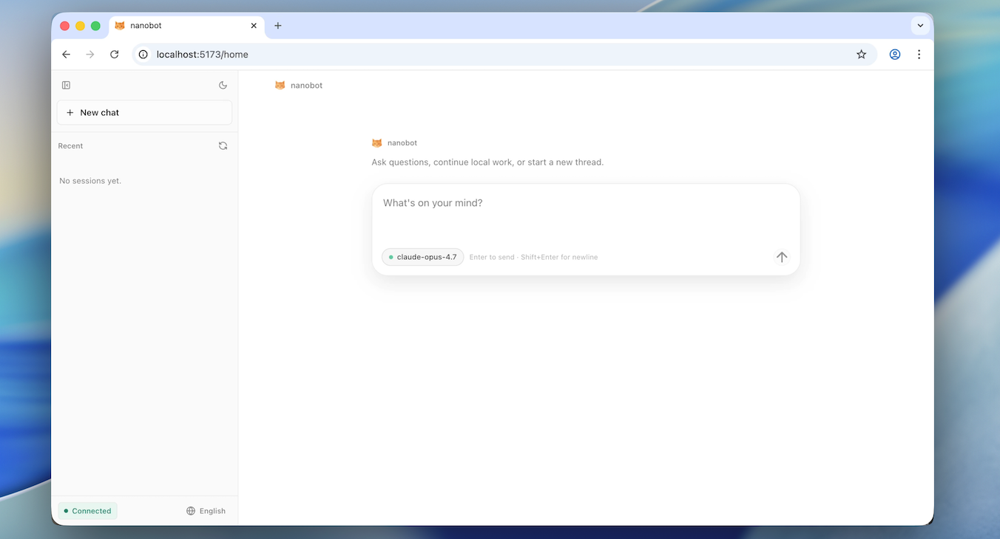
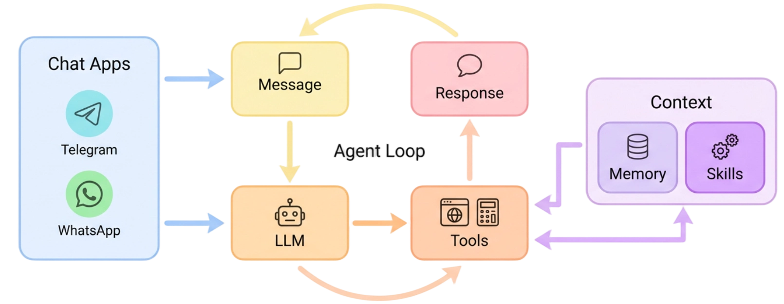
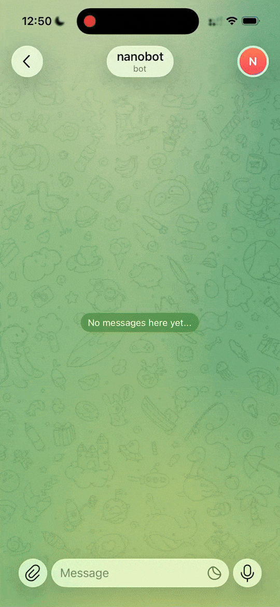
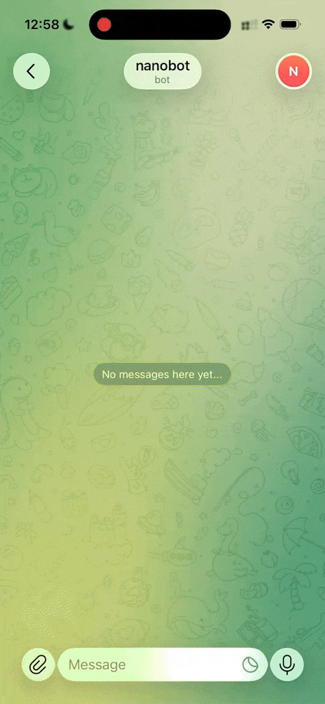

<div align="center">
  <p>
    <a href="https://pypi.org/project/nanobot-ai/"></a>
    <a href="https://pepy.tech/project/nanobot-ai"></a>
    
    
    <a href="https://github.com/HKUDS/nanobot/graphs/commit-activity" target="_blank">
        </a>
    <a href="https://github.com/HKUDS/nanobot/issues?q=is%3Aissue%20is%3Aclosed" target="_blank">
        </a>
    <a href="https://twitter.com/intent/follow?screen_name=nanobot_project" target="_blank">
        </a>
    <a href="https://nanobot.wiki/docs/latest/getting-started/nanobot-overview"></a>
    <a href="./COMMUNICATION.md"></a>
    <a href="./COMMUNICATION.md"></a>
    <a href="https://discord.gg/MnCvHqpUGB"></a>
  </p>
</div>

🐈 **nanobot** 是一款开源的超轻量 AI agent，延续了 [OpenClaw](https://github.com/openclaw/openclaw)、[Claude Code](https://www.anthropic.com/claude-code) 和 [Codex](https://www.openai.com/codex/) 的设计理念。它将核心 agent 循环保持在精简可读，同时支持聊天通道、记忆、MCP 和实用部署路径，让你能以最小开销从本地设置到长期运行的个人 agent。

## 📢 最新动态

- **2026-05-15** 🚀 发布 **v0.2.0** — **`/goal`** 跨轮次保持持续目标，WebUI 内置于 wheel 中，图片生成端到端支持，5 个新 provider 及 `fallback_models`，以及真正的 agent-loop 重构。详见[发版说明](https://github.com/HKUDS/nanobot/releases/tag/v0.2.0)。
- **2026-05-14** 🎯 **`/goal`** 支持长期目标，可见的多步骤进度，聊天中的长期任务。
- **2026-05-13** 🧠 流式推理在回答前展现，自动备份模型，更顺畅的插件重连。
- **2026-05-12** 🎛️ 带 WebUI 徽章的已保存模型预设，更简洁的插件工具，更安静的飞书话题线程。
- **2026-05-11** 🖥️ NVIDIA NIM 支持，终端 bot 名称和图标，流式推理及 MiMo 开关更加明确。
- **2026-05-09** 🖼️ 更清晰的图片回放，设置中自带网页搜索 key，飞书线程清理路由。
- **2026-05-08** ✨ 聊天中内嵌图片，重新设计的设置与密钥界面，Dream 记忆与可见历史对齐。
- **2026-05-07** 📜 WebUI 中按语言环境排序的斜杠命令面板，局域网登录，忠实的 HTTP 流式响应。
- **2026-05-06** 🧩 可调工具提示，更稳定的语音和插件启动，可靠的时间表和提醒。
- **2026-05-05** 🛡️ 未知 Telegram 聊天的静默拒绝，Dream 清理，更完整的自动化摘要。

<details>
<summary>更早的动态</summary>

- **2026-05-04** 🔐 更安全的钉钉外发媒体链接，持久化的 cron 任务，DeepSeek 优化。
- **2026-05-03** ⚙️ 可预测的 Shell 白名单行为，对话回复中隔离聊天，更清爽的交互式重试。
- **2026-05-02** 🐈 LongCat 支持，更智能的 token 大小提示，更清晰的捆绑升级指南。
- **2026-05-01** ☁️ 原生 AWS Bedrock provider，更紧密的助手交接和作用域会话文件。
- **2026-04-30** 💬 飞书线程支持回复和话题，WhatsApp 桥接器随源文件修改刷新。
- **2026-04-29** 🚀 发布 **v0.1.5.post3** — 更智能的飞书/Discord/Slack/Teams 线程，DeepSeek-V4，Hugging Face & Olostep，选项、`/history` 和更稳定的长聊。详见[发版说明](https://github.com/HKUDS/nanobot/releases/tag/v0.1.5.post3)。
- **2026-03-27** 🚀 发布 **v0.1.4.post6** — 架构解耦，移除 litellm，端到端流式传输，微信通道和安全修复。
- **2026-01-30** 🐈 nanobot 首次公开亮相。

</details>

## 💡 核心特性

- **超轻量**：以精简可读的核心实现稳定的长时间 agent 行为。
- **研究友好**：代码库刻意保持简洁，便于学习、修改和扩展。
- **实用至上**：聊天通道、API、记忆、MCP 和部署路径均已内置。
- **可定制**：快速上手后可通过仓库文档深入探索。

## 📦 安装

> [!IMPORTANT]
> 如需最新功能和实验特性，请从源码安装。
> 
> 如需最稳定的日常使用体验，请从 PyPI 安装或使用 `uv`。

**从源码安装**

```bash
git clone https://github.com/HKUDS/nanobot.git
cd nanobot
pip install -e .
```

**使用 `uv` 安装**

```bash
uv tool install nanobot-ai
```

**从 PyPI 安装**

```bash
pip install nanobot-ai
```

## 🚀 快速开始

**1. 初始化**

```bash
nanobot onboard
```

**2. 配置**（`~/.nanobot/config.json`）

配置以下**两部分**（其他选项有默认值）。将以下代码块添加或合并到已有配置中，而不是替换整个文件。

*设置 API Key*（例如 [OpenRouter](https://openrouter.ai/keys)，推荐全球用户）：

```json
{
  "providers": {
    "openrouter": {
      "apiKey": "sk-or-v1-xxx"
    }
  }
}
```

*设置模型*（可选指定 provider — 默认为自动检测）：

```json
{
  "agents": {
    "defaults": {
      "provider": "openrouter",
      "model": "anthropic/claude-opus-4-6"
    }
  }
}
```

**3. 开始聊天**

```bash
nanobot agent
```

- 想使用其他 LLM provider、网页搜索、MCP、安全设置或更多配置选项？见[配置文档](./docs/zh-CN/configuration.md)
- 想在 Telegram、Discord、微信或飞书等聊天应用中使用？见[聊天应用](./docs/zh-CN/chat-apps.md)
- 想用 Docker 或 Linux 服务部署？见[部署文档](./docs/zh-CN/deployment.md)
- 📖 中文文档参见 [`docs/zh-CN/`](./docs/zh-CN/)

## 🌐 WebUI

WebUI **内置在发布的 wheel 包中** — 无需额外构建步骤。只需启用 WebSocket 通道并在浏览器中打开。

<p align="center">
  
</p>

**1. 在 `~/.nanobot/config.json` 中启用 WebSocket 通道**

```json
{ "channels": { "websocket": { "enabled": true } } }
```

**2. 启动网关**

```bash
nanobot gateway
```

**3. 打开 WebUI**

浏览器访问 [`http://127.0.0.1:8765`](http://127.0.0.1:8765)。要从局域网其他设备访问，见 [WebUI 文档 → 局域网访问](./webui/README.md)。

## 🏗️ 架构

<p align="center">
  
</p>

🐈 nanobot 通过将所有功能围绕一个小型 agent 循环构建来保持轻量：消息从聊天应用流入，LLM 决定何时需要工具，记忆或技能仅在作为上下文时才被拉入，而不是变成沉重的编排层。这使核心路径保持可读和易于扩展，同时允许你添加通道、工具、记忆和部署选项，而不会让系统变成庞然大物。

## ✨ 功能展示

<table align="center">
  <tr align="center">
    <th><p align="center">📈 7×24 实时市场分析</p></th>
    <th><p align="center">🚀 全栈软件工程师</p></th>
    <th><p align="center">📅 智能日程管理</p></th>
    <th><p align="center">📚 个人知识助手</p></th>
  </tr>
  <tr>
    <td align="center"><p align="center"></p></td>
    <td align="center"><p align="center"></p></td>
    <td align="center"><p align="center"></p></td>
    <td align="center"><p align="center"></p></td>
  </tr>
  <tr>
    <td align="center">探索 · 洞察 · 趋势</td>
    <td align="center">开发 · 部署 · 扩展</td>
    <td align="center">计划 · 自动化 · 整理</td>
    <td align="center">学习 · 记忆 · 推理</td>
  </tr>
</table>

## 📚 文档

浏览[仓库文档](./docs/zh-CN/)获取最新功能与开发版详情，或访问 [nanobot.wiki](https://nanobot.wiki/docs/latest/getting-started/nanobot-overview) 查阅稳定版文档。

- 通过常用聊天应用与 nanobot 对话：[聊天应用](./docs/zh-CN/chat-apps.md)
- 配置 provider、网页搜索、MCP 和运行时行为：[配置](./docs/zh-CN/configuration.md)
- 将 nanobot 与本地工具和自动化集成：[API](./docs/zh-CN/openai-api.md) · [Python SDK](./docs/zh-CN/python-sdk.md)
- 使用 Docker 或 Linux 服务运行：[部署](./docs/zh-CN/deployment.md)

## 🤝 贡献与路线图

欢迎 PR！代码库刻意保持精简和可读性。🤗

### 分支策略

| 分支 | 用途 |
|--------|---------|
| `main` | 稳定版 — 错误修复和小改进 |
| `nightly` | 实验性功能 — 新功能和破坏性更改 |

**不确定目标分支？** 详见 [CONTRIBUTING.md](./CONTRIBUTING.md)。

**路线图** — 挑选一项并[提交 PR](https://github.com/HKUDS/nanobot/pulls)！

- **多模态** — 看得见、听得见（图片、语音、视频）
- **长期记忆** — 永不遗忘重要上下文
- **更好的推理** — 多步规划和反思
- **更多集成** — 日历等
- **自我改进** — 从反馈和错误中学习

## 联系方式

本项目由 [Xubin Ren](https://github.com/re-bin) 作为个人开源项目发起，并以个人资源独立维护至今，得到了开源社区的贡献。如有问题、想法或合作意向，请联系 [xubinrencs@gmail.com](mailto:xubinrencs@gmail.com)。

### 贡献者

<a href="https://github.com/HKUDS/nanobot/graphs/contributors">
  
</a>

## ⭐ Star 历史

<div align="center">
  <a href="https://star-history.com/#HKUDS/nanobot&Date">
    <picture>
      <source media="(prefers-color-scheme: dark)" srcset="https://api.star-history.com/svg?repos=HKUDS/nanobot&type=Date&theme=dark" />
      <source media="(prefers-color-scheme: light)" srcset="https://api.star-history.com/svg?repos=HKUDS/nanobot&type=Date" />
      
    </picture>
  </a>
</div>

<p align="center">
  <em>感谢访问 ✨ nanobot！</em><br><br>
  
</p>
