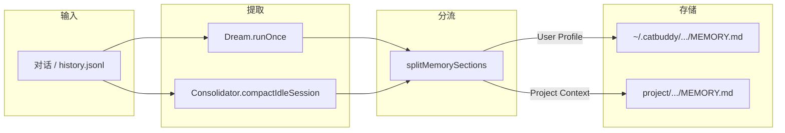

# 工作区、安全边界与分层记忆

本文档描述 CatBuddy Desktop 的 **项目锚点**（`.catbuddy`）、**文件访问安全策略**、**系统提示词对齐**，以及 **全局用户记忆 + 项目记忆** 的分层设计。

## 1. 为什么需要 `.catbuddy`

`.catbuddy` 是嵌入在用户项目根目录下的 **CatBuddy 元数据目录**（类似 `.git`、`.vscode`），用于把「CatBuddy 自身运行时数据」与「用户要操作的文件」分开。

```
projectRoot/                    ← 用户项目根（AI 文件/exec 的工作范围）
├── my-app/                     ← 用户代码、文档
├── docs/
└── .catbuddy/          ← CatBuddy 保留区（工具层禁止写入）
    ├── config/config.json      ← 模型、Provider、MCP 等
    ├── workspace/              ← Agent 内部工作区
    │   ├── AGENTS.md, SOUL.md, USER.md, TOOLS.md
    │   ├── memory/MEMORY.md
    │   ├── skills/
    │   └── sessions/
    └── electron/               ← Electron userData、缓存（仅主目录锚点）
```

### 1.1 两种锚点模式

| 场景 | `projectRoot` | `.catbuddy` 位置 |
|------|---------------|---------------------------|
| 未上传/选择文件夹（默认） | 用户主目录 `~` | `~/.catbuddy/` |
| 上传或选择文件夹 `A` | `A/` | `A/.catbuddy/` |

切换工作空间时，`applyProjectAnchor()`（`services/workspace-anchor.ts`）会：

1. 解析/创建对应锚点
2. 更新 `config.tools.restrictToWorkspace`
3. 调用 `AgentLoop.reanchorProject()` 切换 workspace、PathGuard、ContextBuilder、SessionManager

工作空间列表注册表 **始终** 存放在主目录：

```
~/.catbuddy/workspace-folders.json
```

---

## 2. 文件访问安全（`src/main/security/`）

### 2.1 设计原则

**策略（policy）与 enforcement 分离**：

```
WorkspaceFolder?
    └─► computeWorkspaceFileAccess()  →  WorkspaceFileAccessPolicy
                                              │
projectRoot + catbuddyDir + workspace ◄───────┘
    └─► PathGuard.resolve() / assertAllowed()
            ├─ ToolRegistry（read/write/edit/exec/grep）
            └─ ContextBuilder → identity.md（work_root + 模式说明）
```

| 模块 | 文件 | 职责 |
|------|------|------|
| 策略 | `workspace-access.ts` | 判定敏感地区、计算 `restrictToWorkspace` |
| 执行 | `path-guard.ts` | 路径解析、边界校验、禁止 `.catbuddy` |
| 网络 | `network.ts` | SSRF / URL 校验（`web_fetch` 等） |

统一从 `security/index.ts` 导出。

### 2.2 访问策略规则

```typescript
// security/workspace-access.ts
isSensitiveProjectRoot(projectRoot)  // projectRoot === app.getPath('home')
```

| 条件 | `restrictToWorkspace` | 工具边界 | 相对路径 cwd |
|------|----------------------|----------|--------------|
| 未选文件夹 / 主目录锚点 | `true` | 仅 `…/workspace/` | 内部 workspace |
| 选了文件夹且 **非** 主目录 | `false` | 整个 `projectRoot` | projectRoot |
| 选了文件夹但 **是** 主目录 | `true` | 仅 `…/workspace/` | 内部 workspace |

无论哪种模式，**始终禁止**访问 `.catbuddy` 目录本身。

### 2.3 PathGuard

`PathGuard` 是文件工具的唯一 enforcement 入口（`agent/tools/registry.ts` 内部持有实例）：

- `workRoot`：相对路径默认基准
- `boundary`：允许访问的最大目录
- `resolve()`：解析 + 校验
- `assertAllowed()`：拦截越界与 `.catbuddy`

### 2.4 与系统提示词对齐

`templates/agent/identity.md` 通过 Handlebars 变量与 enforcement 保持一致：

| 变量 | 含义 |
|------|------|
| `work_root` | 当前 `PathGuard.workRoot` |
| `file_access_project` | 项目根模式（可操作 `.catbuddy` 同级目录） |
| `file_access_internal` | 受限模式（仅内部 workspace） |

`ContextBuilder._renderIdentity()` 注入上述变量；**提示词描述必须与 PathGuard 实际行为一致**，避免 Agent 认知与工具拦截脱节。

---

## 3. 分层记忆（Global Profile + Project Memory）

### 3.1 问题背景

每个 `.catbuddy/workspace` 原本完全独立：切换项目后，`USER.md`、`MEMORY.md`、`sessions/` 互不共享，Agent 无法「越聊越懂你」。

### 3.2 解决方案

引入 **两层记忆**：

```
~/.catbuddy/workspace/              ← 全局用户层（始终加载）
├── USER.md                                 ← 用户画像（跨项目共享）
└── memory/MEMORY.md                        ← 关于「你」的长期记忆

D:/Projects/foo/.catbuddy/workspace/   ← 项目层（切换项目时）
├── memory/MEMORY.md                        ← 仅 foo 项目上下文
├── sessions/                               ← 该项目聊天记录
└── AGENTS.md / SOUL.md / TOOLS.md          ← 项目级 Agent 配置
```

判断是否为分层模式：

```typescript
// services/global-profile.ts
isLayeredWorkspace(projectWorkspace)
// true 当 projectWorkspace !== ~/.catbuddy/workspace
```

### 3.3 系统提示词组装

`ContextBuilder.buildSystemPrompt()`（`agent/context.ts`）：

| 内容 | 默认主目录 | 项目 workspace |
|------|------------|----------------|
| `USER.md` | 本地 workspace | **全局** `~/.catbuddy/workspace/USER.md` |
| `AGENTS/SOUL/TOOLS` | 本地 | 项目 workspace |
| 长期记忆 | `Long-Term Memory` | `Long-Term Memory (You)` + `Project Memory` |

### 3.4 记忆写入与分流

**Dream**（`agent/dream.ts`）和 **Consolidator**（`agent/memory.ts`）在提取记忆时，通过 `memoryExtractionPrompt()` 要求 LLM 输出两个固定标题：

| 触发方式 | 说明 |
|----------|------|
| `/compact` | 手动：Consolidator 摘要**完整会话** → MEMORY（保留最近 2 条） |
| `/dream` | 手动：Dream 读取 `history.jsonl` 增量 → MEMORY |
| Cron | 自动：默认每 **120 分钟**（`dreamIntervalMinutes`）运行 Dream |
| 正常对话 | 每轮结束后写入 `history.jsonl`，供 Dream 消费 |

斜杠命令列表由主进程 `COMMAND_SPECS` 经 IPC `commands:list` 提供给 Composer。

```markdown
## User Profile
（姓名、偏好、沟通风格、时区、角色——跨项目通用）

## Project Context
（技术栈、仓库结构、任务、代码决策——仅当前项目）
```

`agent/layered-memory.ts` 中的 `splitMemorySections()` 解析后，`appendLayeredMemory()` 路由写入：

| 段落 | 写入位置 |
|------|----------|
| `User Profile` | `~/.catbuddy/workspace/memory/MEMORY.md` |
| `Project Context` | `{project}/.catbuddy/workspace/memory/MEMORY.md` |

非分层模式（默认主目录）时，整段摘要写入全局 MEMORY。

`LayeredMemoryStore` 包装 project / global 两个 `MemoryStore`；Dream 的 cursor 仍跟踪 **项目层** `history.jsonl`。

### 3.5 数据隔离一览

| 数据 | 作用域 |
|------|--------|
| `USER.md`、用户向 MEMORY | **全局**（主目录 workspace） |
| 项目向 MEMORY | **项目** workspace |
| `sessions/`、`history.jsonl` | **项目** workspace |
| `config/config.json` | **各** `.catbuddy` 独立 |
| `workspace-folders.json` | **全局**（主目录） |

---

## 4. 关键源码索引

| 主题 | 路径 |
|------|------|
| 项目锚点切换 | `services/workspace-anchor.ts` |
| 全局用户 profile | `services/global-profile.ts` |
| 访问策略 | `security/workspace-access.ts` |
| 路径 enforcement | `security/path-guard.ts` |
| 工具注册与 PathGuard | `agent/tools/registry.ts` |
| 系统提示词组装 | `agent/context.ts` |
| 分层记忆写入 | `agent/layered-memory.ts` |
| Dream 周期 | `agent/dream.ts` |
| 会话压缩归档 | `agent/memory.ts`（Consolidator） |
| Agent 生命周期 | `agent/loop.ts` |
| 身份模板 | `templates/agent/identity.md` |
| 用户画像模板 | `templates/USER.md` |
| 记忆模板 | `templates/memory/MEMORY.md` |

---

## 5. 端到端流程

### 5.1 切换工作空间

```mermaid
sequenceDiagram
  participant UI as Renderer
  participant IPC as ipcHandlers
  participant Anchor as workspace-anchor
  participant Loop as AgentLoop
  participant PG as PathGuard
  participant Ctx as ContextBuilder

  UI->>IPC: workspace-folders:set-active
  IPC->>Anchor: applyProjectAnchor(folder)
  Anchor->>Anchor: computeWorkspaceFileAccess()
  Anchor->>Loop: reanchorProject()
  Loop->>PG: setWorkspace + setProjectRoot
  Loop->>Ctx: new ContextBuilder(globalWorkspace=~/.catbuddy/workspace)
  Ctx->>Ctx: buildSystemPrompt() 合并全局 USER + 双层 MEMORY
```

### 5.2 记忆沉淀



---

## 6. 使用建议

1. **日常闲聊、建立用户画像**：使用默认主目录锚点，或直接编辑 `~/.catbuddy/workspace/USER.md`。
2. **在具体项目里写代码**：切换到对应项目 workspace；猫猫仍加载全局 USER 与用户向 MEMORY。
3. **迁移旧数据**：若某项目 MEMORY 里已有「关于你」的内容，可手动复制到全局 `MEMORY.md`；之后 Dream / Consolidator 会自动分层写入。
4. **安全预期**：主目录锚点下 Agent **不能**随意读写 `Documents/`、`Desktop/` 等同级目录；非主目录项目则可操作项目根下与 `.catbuddy` 同级的文件夹。

---

## 7. 相关文档

- [architecture.md](./architecture.md) — 三层进程与用户数据目录概览
- [main-process.md](./main-process.md) — 主进程模块职责
- [src/main/security/README.md](../src/main/security/README.md) — Security 模块速查
